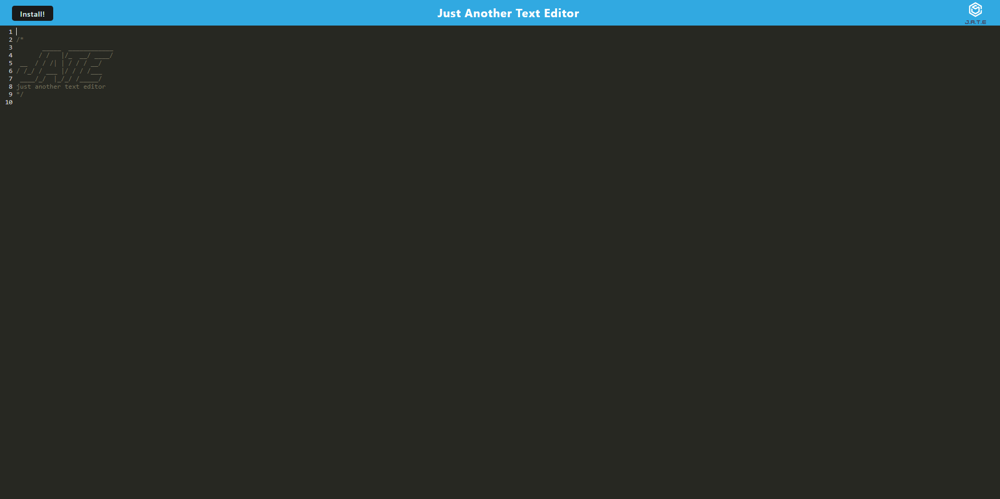

# JATE-PWA-AKA_JAWA

## Description

This is a code refactor of JATE an in browser code editor. Given starter code I had to create the webpack.config.js, src-sw.js, database.js, and install.js. This is a PWA so it can be installed and used offline as well. 

## Table of Contents
* [Installation](#installation)
* [Usage](#usage)
* [License](#license)
* [Display](#display)
* [Contributors](#contributors)
* [Tests](#tests)
* [Questions](#questions)

## Installation
Click on the Install button at the top of the page to get the prompt to install.

## Usage
Visit the link below to use this project.

[JATE](https://jawajatepwa-852a5b25e5b7.herokuapp.com/)

## License
For more information on this license, please visit https://mit-license.org/

## Display

## Contributors
N/A

## Tests
N/A

## Questions
rdheadyii@gmail.com

https://github.com/rdheadyii
